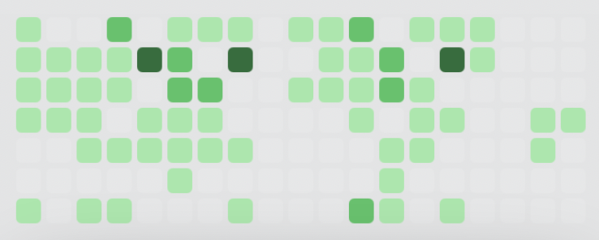

# github-contributions

> A GitHub contribution graph with current streak, yearly total, and per-day tooltips.

A self-contained widget for [Übersicht](http://tracesof.net/uebersicht/). The
entire widget lives in `index.jsx` (the shared design system is inlined), so it
runs on any Mac with no extra files beyond the bundled assets.

### On the desktop

The widget shown running alongside the full set:

<video src="https://github.com/jke48222/github-contributions-widget/raw/main/homescreen.mp4" controls width="100%"></video>

## Install

1. Install and run [Übersicht](http://tracesof.net/uebersicht/).
2. Unzip `github-contributions.widget.zip`, or copy the `github-contributions.widget` folder into your
   Übersicht widgets directory:
   `~/Library/Application Support/Übersicht/widgets/`
3. Refresh Übersicht (menu bar icon -> Refresh All).

## Notes

- With multiple usernames, arrows switch between them.
- Uses a public contributions API by default; set a token for private contributions.
- Optional: install the Instrument Serif and Geist font families for the intended typography; system fonts are used as a fallback.

## How to edit

Set USERS (one or more usernames) and the optional TOKEN at the top of index.jsx.

All visual styling (colors, fonts, the card shell, drag/resize handles) is in
the inlined design-system block at the top of `index.jsx`.

## Bundled files

- `index.jsx`

## Submitting to the Übersicht gallery

Create a public GitHub repo with `widget.json`, `github-contributions.widget.zip`, and a
258x160 (or 516x320 hi-res) `screenshot.png`, then
[open an issue](https://github.com/felixhageloh/uebersicht-widgets/issues) with the URL.

## Other widgets

- [Animated Wallpaper](https://github.com/jke48222/animated-wallpaper-widget)
- [Clipboard History](https://github.com/jke48222/clipboard-history-widget)
- [Daily AI Prompt](https://github.com/jke48222/daily-ai-prompt-widget)
- [Daily Astronomy Photo](https://github.com/jke48222/daily-astronomy-photo-widget)
- [Daily Tarot](https://github.com/jke48222/daily-tarot-widget)
- [Now Playing](https://github.com/jke48222/now-playing-widget)
- [Recent Album Covers](https://github.com/jke48222/recent-album-covers-widget)
- [Recent Downloads](https://github.com/jke48222/recent-downloads-widget)
- [Rotating 3D Model](https://github.com/jke48222/rotating-3d-model-widget)
- [Spinning Globe](https://github.com/jke48222/spinning-globe-widget)
- [Wallpaper Switcher](https://github.com/jke48222/wallpaper-switcher-widget)

## Author

Jalen Edusei <jalen.edusei@gmail.com>
